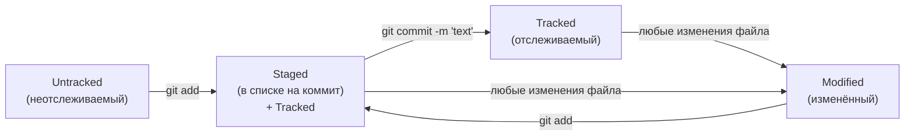

# git-basics
Repository for Git course.

## Хеширование

Хеширование (от англ. hash, «рубить», «крошить», «мешанина») — это способ преобразовать набор данных и получить их «отпечаток» (англ. fingerprint).
Информация о коммите — это набор данных: когда был сделан коммит, содержимое файлов в репозитории на момент коммита и ссылка на предыдущий, или родительский (англ. parent), коммит. 
Git хеширует (преобразует) эту информацию с помощью алгоритма SHA-1 (от англ. Secure Hash Algorithm — «безопасный алгоритм хеширования») и получает для каждого коммита свой уникальный хеш — результат хеширования.
Результат хеширования в Git — символьная строка. Она относительно коротка (40 символов в случае SHA-1) и состоит из цифр 0—9 и латинских букв A—F (неважно, заглавных или строчных). 
Хеш обладает следующими важными свойствами:

  -если хеш получить дважды для одного и того же набора входных данных, то результат будет гарантированно одинаковый;

  -если хоть что-то в исходных данных поменяется (хотя бы один символ), то хеш тоже изменится (причём сильно).
	
Git хранит таблицу соответствий хеш → информация о коммите. Все хеши и таблицу хеш → информация о коммите Git сохраняет в служебные файлы. Они находятся в скрытой папке .git в репозитории проекта.

## git.log

После вызова git log появляется список коммитов с их описанием.
Вот из каких элементов состоит описание:

1.Строка из цифр и латинских букв после слова commit — это уже знакомый вам хеш коммита.

2.Author — имя автора и его электронная почта.

3.Date — дата и время создания коммита.

4.Сообщение к коммиту.

Если в репозитории уже много коммитов — например, сотни или тысячи, — пригодится сокращённый лог.
Сокращённый лог вызывают командой git log с флагом --oneline (англ. «одной строкой»).

## HEAD — всему голова

При вызове команды git log вы также могли заметить надпись (HEAD -> master) после хеша одного из коммитов.

Файл HEAD (англ. «голова», «головной») — один из служебных файлов папки .git. Он указывает на коммит, который сделан последним (то есть на самый новый).
Убедитесь в этом с помощью терминала. Перейдите в папку .git командой cd. Посмотрите содержимое файла HEAD командой cat.
Внутри HEAD — ссылка на служебный файл: refs/heads/master (или refs/heads/main в зависимости от названия ветки). Если заглянуть в этот файл, можно увидеть хеш последнего коммита.
Когда вы делаете коммит, Git обновляет refs/heads/master — записывает в него хеш последнего коммита. Получается, что HEAD тоже обновляется, так как ссылается на refs/heads/master.
При работе с Git указатель HEAD используется довольно часто. Мы уже упоминали, что многие команды Git принимают в качестве параметра хеш коммита. 
Если нужно передать последний коммит, то вместо его хеша можно просто написать слово HEAD — Git поймёт, что вы имели в виду последний коммит.

HEAD - это файл в папке .git, в котором записана ссылка (или ссылка на ссылку) на последний коммит. 
HEAD — это файл в .git, в файле — ссылка, по ссылке — хеш. Совсем как в сказке: иголка — в яйце, яйцо — в утке, утка — в зайце.

## git status

Статусы untracked/tracked, staged и modified

Одна из ключевых задач Git — отслеживать изменения файлов в репозитории. 
Для этого каждый файл помечается каким-либо статусом. Рассмотрим основные.

### untracked (англ. «неотслеживаемый»)

Новые файлы в Git-репозитории помечаются как untracked, то есть неотслеживаемые. Git «видит», что такой файл существует, но не следит за изменениями в нём. 
У untracked-файла нет предыдущих версий, зафиксированных в коммитах или через команду git add.

### staged (англ. «подготовленный»)

После выполнения команды git add файл попадает в staging area (от англ. stage — «сцена», «этап [процесса]» и area — «область»), то есть в список файлов, которые войдут в коммит. 
В этот момент файл находится в состоянии staged.

💡 Staging area также называют index (англ. «каталог») или cache (англ. «кеш»), а состояние файла staged иногда называют indexed или cached. 
Все три варианта могут встречаться в документации и в качестве флагов команд Git. 
А также в интернете — например, в вопросах и ответах на сайте Stack Overflow.

### tracked (англ. «отслеживаемый»)

Состояние tracked — это противоположность untracked. Оно довольно широкое по смыслу: в него попадают файлы, 
которые уже были зафиксированы с помощью git commit, а также файлы, которые были добавлены в staging area командой git add. 
То есть все файлы, в которых Git так или иначе отслеживает изменения.

### modified (англ. «изменённый»)

Состояние modified значит, что Git сравнил содержимое файла с последней сохранённой версией и нашёл отличия. 
Например, файл был закоммичен и после этого изменён.

Вот что ещё важно учесть:

 -Для файлов в состояниях staged и modified обычно не указывается, что они также tracked, потому что это состояние подразумевается.

 -Команда git add добавляет в staging area только текущее содержимое файла. 
  Если вы, например, сделаете git add file.txt, а затем измените file.txt, то новое содержимое файла не будет находиться в staging. 
  Git сообщит об этом с помощью статуса modified: файл изменён относительно той версии, которая уже в staging. 
  Чтобы добавить в staging последнюю версию, нужно выполнить git add file.txt ещё раз.

## Типичный жизненный цикл файла в Git

1. Файл только что создали. Git ещё не отслеживает его содержимое. Состояние: untracked.

2. Файл добавили в staging area с помощью git add. Состояние: staged (+ tracked).

   a. Возможно, изменили файл ещё раз. Состояния: staged, modified (+ tracked).
      Обратите внимание: staged и modified у одного файла, но у разных его версий.
  
   b. Ещё раз выполнили git add. Состояние: staged (+ tracked).

3. Сделали коммит с помощью git commit. Состояние: tracked.

4. Изменили файл. Состояние: modified (+ tracked).

5. Снова добавили в staging area с помощью git add. Состояния: staged (+ tracked).

6. Сделали коммит. Состояния: tracked.

7. Повторили пункты 4−7 много-много раз.

### Какие состояния показывает команда git status

Большинство файлов в типичном проекте будут находиться в состоянии tracked (то есть закоммичены и не изменены после коммита). 
Вы не увидите это состояние в выводе команды git status — иначе она бы каждый раз выводила список вообще всех файлов проекта. 
В итоге git status показывает только следующие состояния файлов:

  -staged (Changes to be committed в выводе git status);

  -modified (Changes not staged for commit);

  -untracked (Untracked files).

## Оформление сообщений к коммитам

То, как написаны сообщения к коммитам, тоже может подчиняться определённым правилам. 
Иногда эти правила продиктованы культурой команды, а иногда техническими ограничениями. 
Например, в выводе команды git log --oneline умещается максимум 72 первых символа сообщения, поэтому многие правила включают пункт: «Сообщение не должно быть длиннее 72 символов».

Есть общие рекомендации по тому, как правильно составить сообщение. Оно должно быть:

  -относительно коротким, чтобы его было легко прочитать;

  -информативным.

### Стили оформления:

#### Корпоративный

Во многих компаниях применяется Jira — система для организации проектов и задач. 
У каждой задачи в Jira есть идентификатор из нескольких заглавных латинских букв и номера. 
Например, LGS-239 значит, что это 239-я задача в проекте LGS (сокращение от англ. logistics — «логистика»).
В корпоративном стиле в начале сообщения обычно указывают Jira-ID, а после — текст сообщения.

$ git commit -m "LGS-239: Дополнить список пасхалок новыми числами" 

#### Conventional Commits(соглашение о коммитах)

https://www.conventionalcommits.org/ru/v1.0.0-beta.4/#%D1%81%D0%BF%D0%B5%D1%86%D0%B8%D1%84%D0%B8%D0%BA%D0%B0%D1%86%D0%B8%D1%8F

Conventional Commits предлагает такой формат коммита: <type>: <сообщение>. 
Первая часть type — это тип изменений. 

Таких типов достаточно много. Вот два примера:

  -feat (сокращение от англ. feature) — для новой функциональности;

  -fix (от англ. «исправить», «устранить») — для исправленных ошибок.

Например, сообщение может быть таким:

git commit -m "feat: добавить подсчёт суммы заказов за неделю" 

#### GitHub-стиль

GitHub можно использовать не только для хранения файлов проекта, но и для ведения списка задач (англ. issue) этого проекта. 
Если коммит «закрывает» или «решает» какую-то задачу, то в его сообщении удобно указывать ссылку на неё. 
Для этого в любом месте сообщения нужно указать #<номер задачи>. 

Например, вот так.

$ git commit -m "Исправить #334, добавить график температуры" 

В таком случае GitHub свяжет коммит и задачу.

💡 Для сообщений на русском языке часто рекомендуют использовать инфинитивы. 
Например: Добавить тесты для PipkaService, Исправить ошибку #123 и так далее.

Для сообщений на английском рекомендуется использовать повелительное наклонение (англ. imperative). 
Например: Use library mega_lib_300, Fix exit button и так далее.
Эти рекомендации сложились исторически, и им следуют многие проекты.